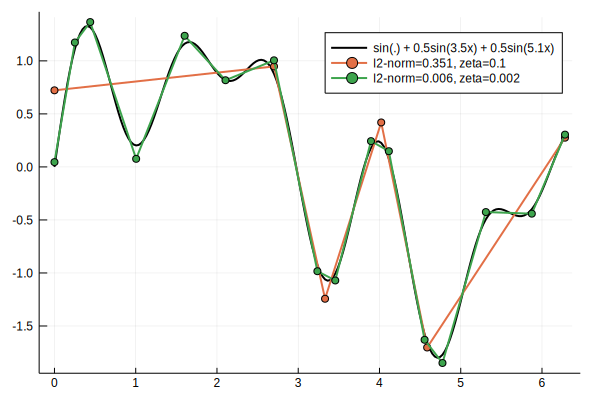

# EllZeroTrendFiltering

[](https://travis-ci.com/mfalt/EllZeroTrendFiltering.jl)

[](https://codecov.io/gh/mfalt/EllZeroTrendFiltering.jl)

### Example: Constrained approximation

Find best continouous piecewise approximations with up to M segments
```julia
using EllZeroTrendFiltering, Plots
#Get sample data
N = 400
data = snp500_data()[1:N]

#Find solutions to the constrained problem, with up to M=10 segments
M = 10
Ivec, Yvec, fvec = fit_pwl_constrained(data, M)

#Plot original data
plot(data, l=:black, lab = "SNP500")
#Plot solution with 5 segments
plot!(Ivec[5], Yvec[5], l=2, m=:circle, lab="m=5, cost = $(round(fvec[5],3))")
#Plot solution with 10 segments
plot!(Ivec[M], Yvec[M], l=2, m=:circle, lab="m=$M, cost = $(round(fvec[M],3))")

```


### Example: Regularization

Find best continouous piecewise approximations with cost ζ per breakpoint.
```julia
using EllZeroTrendFiltering, Plots

g(x) = sin(x) + 0.5sin(3.5x) + 0.5sin(5.1x)
t = linspace(0,2π,201)

plot(g, t, l=(2,:black), lab="sin(x) + 0.5sin(3.5x) + 0.5sin(5.1x)")
for ζ ∈ [0.1, 0.002]
    # Minimize ∫(f(x)-g(x))²dx + ζ⋅||d²f/dx²||₀
    # Will automatically integrate the function to compute the costs
    I, Y, cost = fit_pwl_regularized(g, t, ζ)

    plot!(t[I], Y, l=2, m=:circle, lab = "l2-norm=$(round(cost,3)), zeta=$ζ")
end
plot!() # Show plot
```

